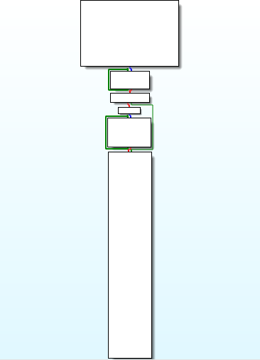
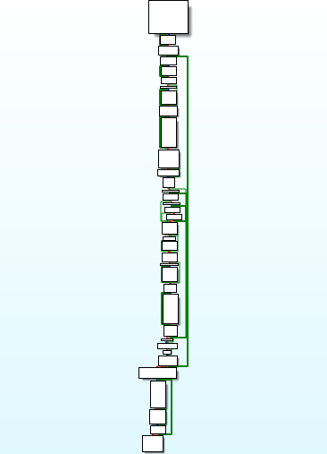

# Peirce's arrow Virtual Machine Demo

C++ implementation of core of virtual 32-bit processor [based on NOR](https://en.wikipedia.org/wiki/Logical_NOR)

# Graph

Native vs VM graph

 

# Credits

The `vm_core` was written by [Alexander (Rouse_) Bagel](https://rouse.drkb.ru/other.php#vm_core)